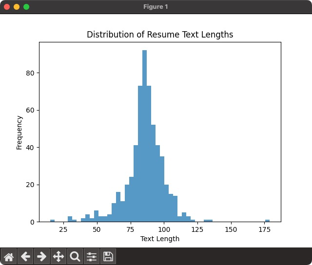

# AJAX Utils

## Max length

The max length script is used to display the distribution of the resume text length.  

It helps tunning the length of the tokenizer when initializing it.  

The intent of this script is just for helping purpose and not meant to be included in the rest of program.